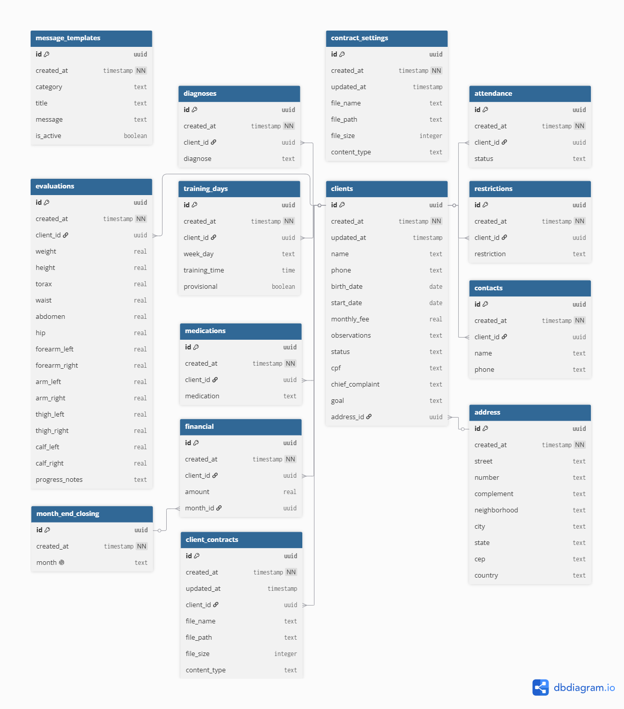

# StudioLife Pilates

Aplicação web completa para gerenciamento de estúdio de pilates. O sistema permite controlar alunos, avaliações, finanças, presença, programação semanal, aniversariantes, modelos de mensagens e contratos, com integração ao WhatsApp para comunicação rápida.

## Arquitetura

O StudioLife é uma Single Page Application (SPA) desenvolvida com React e empacotada pelo Vite. A arquitetura segue uma organização modular por responsabilidade:

- **Frontend**: React 19 com hooks e componentes funcionais. O roteamento é feito com React Router DOM 7 e a estilização utiliza Tailwind CSS 4.
- **Backend como Serviço (BaaS)**: Supabase fornece autenticação, banco de dados PostgreSQL e API REST/Realtime.
- **Cliente Supabase centralizado**: Todas as chamadas ao banco passam por `src/services/supabase.js`, garantindo um único ponto de configuração.
- **Componentes reutilizáveis**: Elementos como `PageHeader`, `Loading`, `ErrorMessage`, `ConfirmDialog` e `Layout` são compartilhados entre as páginas.
- **Hooks customizados**: `useAuth` encapsula o acesso ao contexto de autenticação.
- **Páginas por domínio**: Cada funcionalidade principal vive em um arquivo sob `src/pages/`, facilitando manutenção e evolução.
- **RLS (Row Level Security)**: O banco utiliza políticas de segurança para garantir que apenas usuários autenticados acessem e modifiquem os dados.

## Funcionalidades por interface

### Login

- Tela de autenticação com email e senha via Supabase Auth.
- Redirecionamento automático para o dashboard quando o usuário já está logado.
- Proteção de rotas: páginas internas só são acessíveis após autenticação.

### Dashboard

- Exibe o total de alunos ativos em destaque.
- Apresenta cards de acesso rápido para as principais áreas do sistema: Alunos, Avaliações, Presença, Financeiro e Aniversariantes.
- Executa automaticamente, a partir do dia 10 de cada mês, o fechamento mensal: cria o registro do mês em `month_end_closing` e gera os débitos de mensalidade para todos os alunos ativos.

### Alunos

- Lista todos os alunos cadastrados com busca por nome e filtro para exibir ou ocultar inativos. Alunos pausados aparecem sempre na listagem.
- Cada card exibe nome, idade, telefone mascarado, endereço, dias de treino, contatos, diagnósticos, restrições, medicações, observações, status e badge de avaliação pendente.
- Cadastro/edição com dados pessoais (nome, telefone, CPF, data de nascimento, data de início, mensalidade, queixa principal, objetivo, observações e status: Ativo, Inativo ou Pausado).
- Modal de endereço com CEP formatado (Rua, Número, Complemento, Bairro, Cidade, Estado).
- Seções dinâmicas para contatos, dias de treino (com horários inteiros e flag de dia provisório), diagnósticos, restrições e medicações.
- Regra automática: ao atingir 3 faltas no mesmo mês, o aluno é pausado automaticamente e deixa de aparecer na lista de presença e na programação semanal.

### Avaliações

- Lista avaliações agrupadas por aluno ativo.
- Permite criar, visualizar, editar e excluir avaliações com diversas medidas corporais.
- Exibe badge de "Avaliação pendente" nos cards de aluno quando não há avaliação ou a última tem mais de três meses.

### Financeiro

- Controle de movimentações financeiras por mês, com base na tabela `month_end_closing`.
- Seletor de mês com botões de navegação (anterior/próximo).
- Listagem agrupada por aluno, mostrando o saldo total do aluno no mês selecionado.
- Modal de detalhes com data, tipo (Crédito/Débito) e valor de cada movimentação.
- Botão de envio de mensagem de cobrança via WhatsApp, com seleção de template ativo da categoria "Cobrança" e substituição do placeholder `{{ALUNO}}`.
- Validação de telefone: se o aluno não possui número cadastrado, abre modal para inclusão antes do envio.
- Formulário de nova movimentação vinculado ao mês selecionado, permitindo também escolher outro mês existente.
- Saldo total do mês exibido em destaque.

### Presença

- Registro de presença por data, com navegação por setas e seletor de data.
- Alunos agrupados por horário e ordenados alfabeticamente.
- Opções de presença: Presente, Ausente e Falta justificada.
- Para faltas justificadas, permite agendar reposição informando dia e horário, ou marcar "Não reagendar".
- Dias de treino provisórios são removidos automaticamente ao registrar falta justificada com reposição.
- Botão de acesso à Programação Semanal.
- Quando o status é "Ausente", exibe badge laranja com a quantidade de faltas do aluno no mês e ícone de mensagem para enviar uma mensagem de ausência via WhatsApp, usando template ativo da categoria "Ausência" e substituindo `{{ALUNO}}`.
- Validação de telefone igual às demais telas: abre modal para cadastro se necessário.

### Programação Semanal

- Grade visual de horários de segunda a sexta.
- Cabeçalho e coluna de horários fixos durante o scroll.
- Texto dos horários rotacionado em 90º.
- Barra de rolagem horizontal sempre visível.
- Botão para voltar à tela de Presença.

### Aniversariantes

- Dois modos de visualização: aniversariantes do mês atual e aniversariantes da semana.
- Cards com nome, data do aniversário, idade, telefone e tempo como aluno.
- Ícone de bolo clicável para enviar mensagem de aniversário via WhatsApp, usando template ativo da categoria "Aniversário" e substituindo `{{ALUNO}}`.
- Validação de telefone com modal de cadastro quando necessário.

### Configurações

- Área de configurações com acesso a duas funcionalidades: **Templates de Mensagens** e **Contratos**.

#### Templates de Mensagens

- Cadastro, edição e inativação de modelos de mensagens.
- Categorias: Aniversário, Ausência, Cobrança e Contrato.
- Campo de mensagem grande com contador de caracteres no formato `#.##0 caracteres`.
- Botão "ALUNO" que insere o placeholder `{{ALUNO}}` no ponto do cursor.

#### Contratos

- Upload do modelo de contrato em `.docx` com os placeholders `{{ALUNO}}`, `{{CPF}}`, `{{ENDERECO}}`, `{{FREQUENCIA}}`, `{{DIAS_HORARIOS}}` e `{{MENSALIDADE}}`.
- Área de geração de contrato com seletor de alunos ativos (com busca por nome).
- **Baixar contrato**: se o aluno já possui contrato assinado vinculado, faz o download do arquivo; caso contrário, gera o PDF a partir do modelo com as substituições.
- **Enviar mensagem de contrato**: busca o template ativo da categoria "Contrato", substitui `{{ALUNO}}` pelo primeiro nome e abre o WhatsApp.
- **Upload de contrato assinado**: envia um PDF para o Supabase Storage vinculado ao aluno, com confirmação de substituição se já existir um contrato.

## Tecnologias

- React 19
- Vite 8
- React Router DOM 7
- Tailwind CSS 4
- Lucide React (ícones)
- Supabase (Auth + PostgreSQL + Storage)
- docxtemplater, docx-preview, html2canvas e jsPDF para geração de contratos em PDF
- Deploy no Netlify

## Configuração do Supabase

1. Crie um projeto em [https://supabase.com](https://supabase.com).
2. No SQL Editor, execute o conteúdo do arquivo `db/TABLES_SCHEMA.sql` para criar as tabelas.
3. Execute também o arquivo `db/rls_policies.sql` para habilitar RLS, criar as policies de acesso e configurar os buckets de Storage.
4. Se o projeto já possui dados em produção, execute os scripts da pasta `db/migrations/` na ordem numérica para aplicar alterações incrementais.
5. Copie a **Project URL** e a **anon public** API key do menu **Settings > API**.

## Autenticação

O app usa o Supabase Auth com email e senha.

1. No Supabase, acesse **Authentication > Providers** e mantenha **Email** habilitado.
2. Crie um usuário em **Authentication > Users** (ou permita signup pela aplicação).

> Se preferir desabilitar a confirmação de email, vá em **Authentication > Providers > Email** e desligue **Confirm email**.

## Desenvolvimento local

```bash
npm install
```

Crie um arquivo `.env` na raiz do projeto com as variáveis do Supabase:

```env
VITE_SUPABASE_URL=https://seu-projeto.supabase.co
VITE_SUPABASE_ANON_KEY=sua-chave-anon-publica
```

Inicie o servidor de desenvolvimento:

```bash
npm run dev
```

## Build

```bash
npm run build
```

## Deploy no Netlify

1. Envie o código para um repositório Git (GitHub, GitLab ou Bitbucket).
2. No Netlify, clique em **Add new site** > **Import an existing project**.
3. Escolha o repositório.
4. Configure as variáveis de ambiente em **Site settings > Environment variables**:
   - `VITE_SUPABASE_URL`
   - `VITE_SUPABASE_ANON_KEY`
5. O arquivo `netlify.toml` já configura o comando de build (`npm run build`) e o diretório de publicação (`dist`).

## Estrutura de pastas

```
src/
  components/     # Componentes reutilizáveis (Layout, Loading, PageHeader, etc.)
  context/        # Contextos (AuthContext)
  hooks/          # Hooks customizados (useAuth)
  pages/          # Dashboard, Clients, Evaluations, Financial, Attendance, Birthdays, WeeklySchedule, Settings, MessageTemplates, ContractSettings
  services/       # Cliente Supabase e serviço de geração de contratos
  utils/          # Funções utilitárias compartilhadas
  App.jsx         # Rotas da aplicação
  main.jsx        # Ponto de entrada
db/
  TABLES_SCHEMA.sql
  rls_policies.sql
  schema.dbml
  StudioLifeDiagram.svg
  migrations/     # Scripts de migração do banco
```

## Schema do banco

Veja os arquivos `db/TABLES_SCHEMA.sql` e `db/schema.dbml`. O diagrama completo está disponível abaixo:


